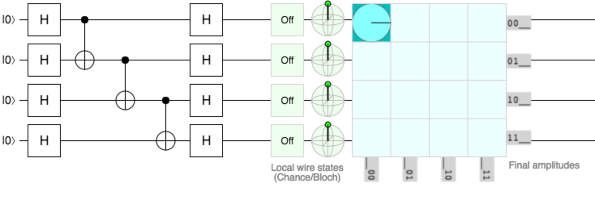

## Initial characterisation of the path-integral simulation method

2 quantum simulators were written, using wither the path integral or direct matrix multiplication method of simulation. The circuit used for benchmarking is shown for 4 qubits in Figure \ref{fig:entangle-deentange}. This circuit fully entangles and then separates the qubits, and so is close to a worst case benchmark for the path integral method.

The path integral method was extended using memoization. The time to find the full final state is shown in Figure \ref{fig:timeings}.

Both methods scale exponentially with the circuit size, but the path integral method is a constant factor faster for large circuit sizes. For very small circuits the matrix multiplication method is faster. The matrix multiplication code used BLAS wrappers for f#, and was so able to take advantage of the 4 cores of the laptop used whereas the path integral method is single-threaded.

The circuit is extended for more qubits by increasing the height of the H-gate layers at start and end, and adding more controlled-NOT gates.