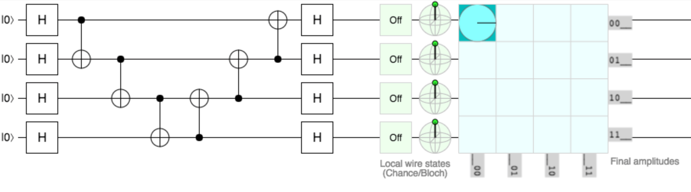
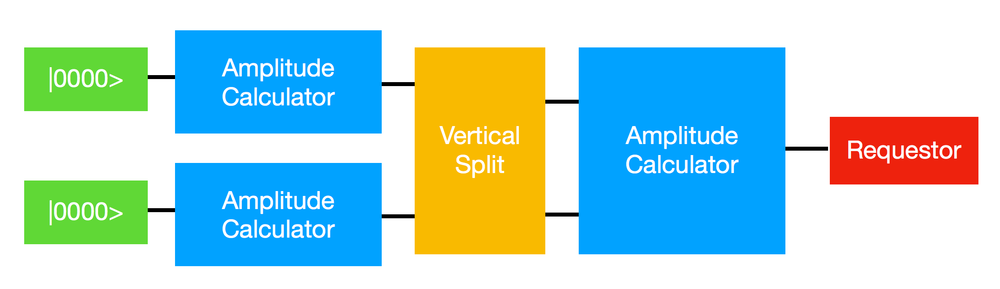

# Optimising the circuit layout

With the basic blocks of a non-recursive amplitude evaluator and qubit-state based work assignment, there are many possible circuit layouts with different performance characteristics.

The variables to optimise over for time to solution are:
* depth of any individual amplitude finder
* split positions of the height-based work devision
* Amount of local cache between amplitude finders for avoiding state recompilation.

We want to find a layout that minimises time-to-solution whilst respecting on-chip resource limits.

## Early work

To test the capability of the network-shape based configuration to find non-trivial good layouts, a simple circuit was tested. 2 layers of CNOT gates were used to entangle the target state and ensure all prior states need to be explored, as for this algorithm it is a worst-case circuit with no optimisation possibility.\footnote{Need to be careful - it is easy to statically prove this circuit is a NOP with gate rearrangement. A optimising quantum compiler would take advantage of this, but as we are not attempting to optimise the input circuit this should be as hard to calculate as a random matrix circuit.} This is shown in Figure \ref{fig:circ}.





A simple, parameterizable computational layout was used to investigate the effect of layout on performance. The number and interconnectivity of blocks was fixed, but the depth of the parallel pair of amplitude calculation blocks was changed from only a single gate to 13 out of 14 gates. The vertical split was fixed at the (binary) middle state, $\ket{0011}$. Requests for target states with binary interpretations equal or higher than this are routed to the lower amplitude finder.

The total runtime for this circuit against split position is plotted in Figure \ref{fig:results}.


There are 2 notable performance changes. First is the 1/depth upper bound that might be expected by the increasing available parallelisation. Second is the large reduction in runtime at 3, 6 and 9 qubit depth splits. This corresponds to the ends of the descending or ascending CNOT groups, and the end of the first H gates.

```c++
static circuit_t circuit = {
    (gate_t){H, 1, {0}}, (gate_t){H, 1, {1}}, (gate_t){H, 1, {2}}, (gate_t){H, 1, {3}},
    
    (gate_t){CNOT, 2, {0, 1}},
    (gate_t){CNOT, 2, {1, 2}},
    (gate_t){CNOT, 2, {2, 3}}, // idx 6
    
    (gate_t){CNOT, 2, {1, 0}},
    (gate_t){CNOT, 2, {2, 1}},
    (gate_t){CNOT, 2, {3, 2}}, // idx 9

    (gate_t){H, 1, {0}}, (gate_t){H, 1, {1}}, (gate_t){H, 1, {2}}, (gate_t){H, 1, {3}}
};
```

I expect a bayesian optimiser will be able to identify and exploit this kind of structure automatically. I'm doing this next.

## Optimiser structure.

Things I think will be useful:
* long, narrow ampfinders near the init space
* wide, short near the end.

can be decomposed into
* high density of splits at end. so want some kind of paramterizable exp curve that is the density of splits, so basically split every level at the end but not at the start.
* perhaps a NSPLITS thing. So we could use like the cumlative distribution of the normal function?

spec:

0 at 0, 1 at 1.
F' > 0 apart from at 0, 1 where F' == 0
some kind of slope, centering control.
